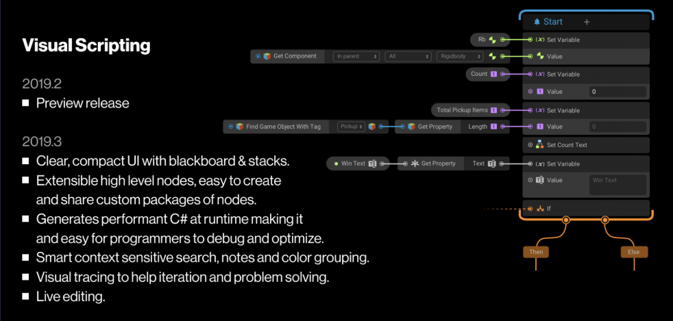

Contents
---
<kbd>C</kbd> <a href="/Camera">Camera</a> • <a href="/Character Controlling">Character Controlling</a> • <a href="/Collision Detection">Collision Detection</a>  
<kbd>E</kbd> <a href="/Events">Events</a> • <a href="/Exceptions">Exceptions</a>  
<kbd>G</kbd> <a href="/Gameflow">Gameflow</a>  
<kbd>I</kbd> <a href="/Interface">Interface</a>  
<kbd>L</kbd> <a href="/Level Management">Level Management</a>  
<kbd>M</kbd> <a href="/Misc">Misc</a>  
<kbd>R</kbd> <a href="/Raycasts">Raycasts</a>  
<kbd>S</kbd> <a href="/Strings">Strings</a>  
<kbd>T</kbd> <a href="/Threads">Threads</a>  
<kbd>U</kbd> <a href="/UI">UI</a>    

In addition follow up <B>Visual Scripting</B>, a feature of Unity'19 -  

